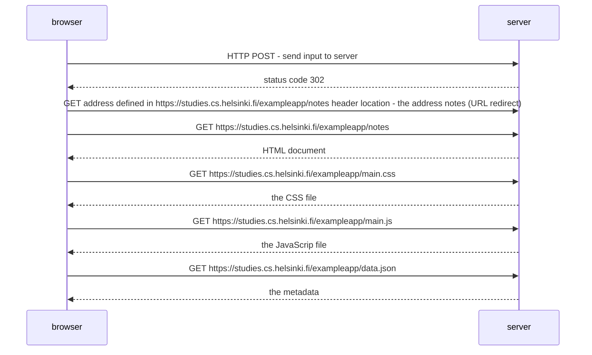

## New Note Diagram

```mermaid
sequenceDiagram

    browser->>server: HTTP POST - send input to server
    server-->>browser: status code 302

    browser->>server: GET address defined in https://studies.cs.helsinki.fi/exampleapp/notes header location - the address notes (URL redirect)

    browser->>server: GET https://studies.cs.helsinki.fi/exampleapp/notes
    server-->>browser: HTML document

    browser->>server: GET https://studies.cs.helsinki.fi/exampleapp/main.css
    server-->>browser: the CSS file

    browser->>server: GET https://studies.cs.helsinki.fi/exampleapp/main.js
    server-->>browser: the JavaScrip file

    browser->>server: GET https://studies.cs.helsinki.fi/exampleapp/data.json
    server-->>browser: the metadata

```
