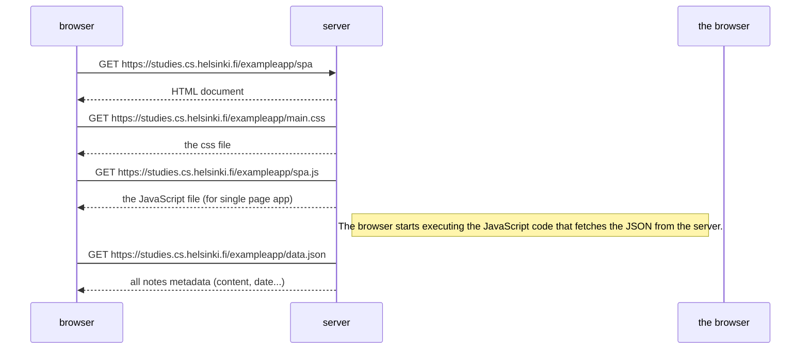

## Single Page App Diagram

```mermaid
sequenceDiagram

    browser->>server: GET https://studies.cs.helsinki.fi/exampleapp/spa
    server-->>browser: HTML document

    browser->server: GET https://studies.cs.helsinki.fi/exampleapp/main.css
    server-->>browser: the css file

    browser->server: GET https://studies.cs.helsinki.fi/exampleapp/spa.js
    server-->>browser: the JavaScript file (for single page app)
    Note left of the browser: The browser starts executing the JavaScript code that fetches the JSON from the server.

    browser->server: GET https://studies.cs.helsinki.fi/exampleapp/data.json
    server-->>browser: all notes metadata (content, date...)
```
